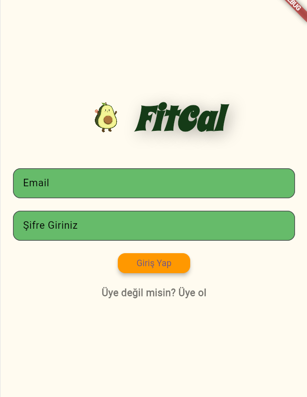
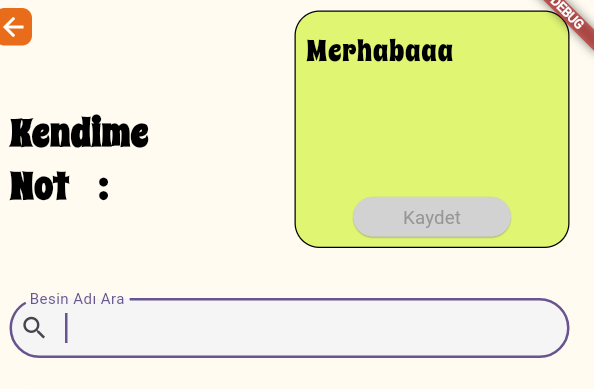
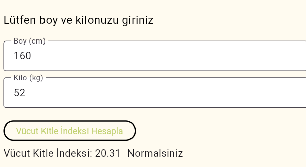

# FitCal
Flutter app for calorie programming, body mass index calculation, and setting quick self-remotes.


## 📱 Project Overview

**Fitcal** is a Flutter-based fitness/calendar (fit calendar) application. It provides Firebase integration for user authentication (auth) and Firestore database support. The app is currently in development focused on login/register pages.

### 🎯 Key Features

- **Firebase Auth**: User registration, login, and logout with email/password.
- **Firestore**: Database support (ready for future features).
- **Multi-Platform**: Android, iOS, Web, Windows, macOS, Linux support.
- **Turkish Interface**: User-friendly design with login pages (`giris1.dart`, `giris2.dart`, `giris3.dart`) and `login_register_page.dart`.
- **Custom Fonts and Assets**: SpicyRice font and images like avokado.png.

## 📸 Screenshots

  
*G1: Homepage with login and register screen.*

  
*G3: Body Mass Index (BMI) calculation screen.*

  
*G3.1: Screen to add food and calculate calories. Navigate to weekly food list page + area to write sweet notes.*

### 📦 Tech Stack

- **Framework**: Flutter (Dart SDK ^3.5.3)
- **Backend**: Firebase (Core, Auth v5.3.4, Firestore v5.0.0)
- **Others**: intl (internationalization), cupertino_icons

## 🚀 Quick Start

### Prerequisites

- Flutter SDK (3.5.3+): [flutter.dev](https://flutter.dev)
- Firebase project: [console.firebase.google.com](https://console.firebase.google.com) (using fitcal-f3227)
- Android Studio / Xcode (platform-specific)

### Setup Steps
1. **Clone Repository**:
  
   ```
   git clone <repo-url>
   cd fitcal
   ```

2. **Flutter Dependencies**:
 
   ```
   flutter pub get
   ```

3. **Firebase Setup**:

   
   - `firebase_options.dart` is already configured (fitcal-f3227 project).
   - Android: `android/app/google-services.json` exists.
   - iOS: Add `ios/Runner/GoogleService-Info.plist` if needed.
   - Update with FlutterFire CLI: `flutterfire configure`

4. **Run the App**:

   
   ```
   flutter run
   ```
   - Web: `flutter run -d chrome`
   - Android/iOS: Connect device/emulator.

### Platform-Specific Builds
```
flutter build apk  # Android
flutter build ios  # iOS
flutter build web  # Web
```

## 📂 Project Structure
```
lib/
├── main.dart              # App entry (LoginRegisterPage as home)
├── firebase_options.dart  # Firebase config (multi-platform)
├── service/
│   └── auth.dart          # Auth service (createUser, signIn, signOut)
└── pages/
    ├── login_register_page.dart
    ├── giris1.dart        # Login page 1
    ├── giris2.dart
    ├── giris3.dart
    └── onceden.dart       # Previous screen?
```

## 🔧 Development


- **Code Standards**: Flutter lints via `analysis_options.yaml`.
- **Testing**: `flutter test`
- **Hot Reload**: Press `r` during `flutter run`.

### Common Commands

```
flutter clean && flutter pub get  # Clean and refresh
flutter pub outdated              # Check updates
flutter doctor                    # Environment check
```

## 🚧 Future Features (Estimated)


- Fitness calendar integration.
- User profiles and workout logs (Firestore).
- Push notifications.

## 📞 Support


- Issues: Open on GitHub repo.
- Flutter Docs: [docs.flutter.dev](https://docs.flutter.dev)

---


